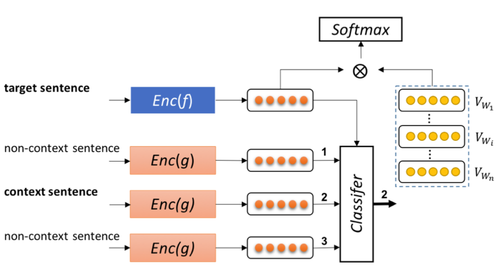
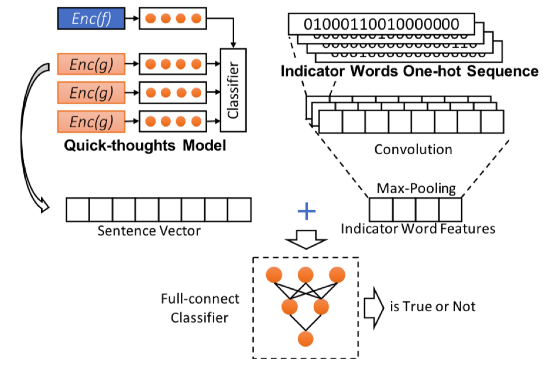

# ICNet

Code for "ICNet: Incorporating Indicator Words and Contexts to Identify Functional Description Information", IJCNN 2019

### Dependency

While this implement might work for many cases, it is only tested for environment below:

```
numpy
sklearn
jieba == 0.39
pytorch == 1.0.1
tqdm
```

### Preprocess

```bash
cd preprocess
python3 pre_classify_data.py
python3 build_stop_word_list.py
python3 segment.py
python3 indicator_tagging.py
```

### Architecture

#### ICNet multi-tasks model

<div align=center>

</div>

> After pre-process dataset:

Training multi-task model:

```bash
python3 main.py
```

Generating classification dataset:

```bash
cd preprocess
python3 build_classify_data.py
```

Training and evaluating classifier:

```bash
python3 classifier_quick.py
```

#### ICNet ensemble model

<div align=center>

</div>

### Citation

If you find this work is useful in your research, please consider citing:

```
@inproceedings{liu2019icnet,
  title={ICNet: Incorporating Indicator Words and Contexts to Identify Functional Description Information},
  author={Qu Liu and Zhenyu Zhang and Yanzeng Li and Tingwen Liu and Diying Li and Jinqiao Shi},
  booktitle={2019 International Joint Conference on Neural Networks, {IJCNN} 2019},
  year={2019},
}
```

